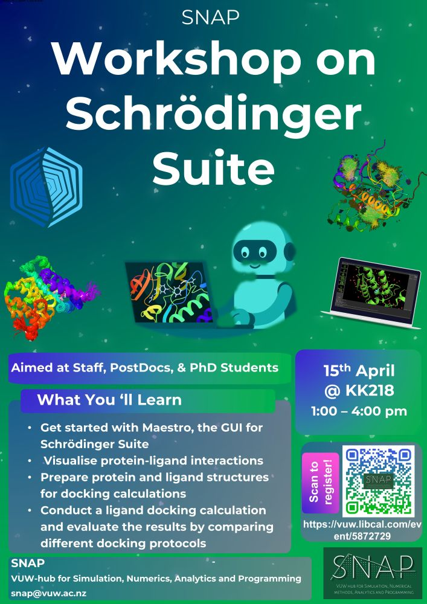

:::: {.columns}

::: {.column width="55%"}
# SNAP Workshop: Introduction to Schrödinger Suite for Ligand Docking

SNAP is hosting an Introductory Workshop on the Schrödinger Suite, presented by Dr. Wanting Jiao, whose research focuses on computational biochemistry and biophysics. 

Molecular modelling techniques such as ligand docking are widely used to study protein–ligand interactions and play an important role in drug discovery and development. 

During the session, participants will:

- Get started with Maestro
- Visualise protein–ligand interactions
- Prepare protein/ligand structures
- Perform docking calculations

📅 **When:** Wednesday, 15 April 2026, 1:00 – 4:00 pm  
📍 **Where:** KK218 Cyber Common Room  
📝 [Register here](https://vuw.libcal.com/event/5872729)
:::

::: {.column width="5%"}
<!-- This is just a spacer column -->
:::

::: {.column width="40%"}
{fig-align="center"}
:::

::::
