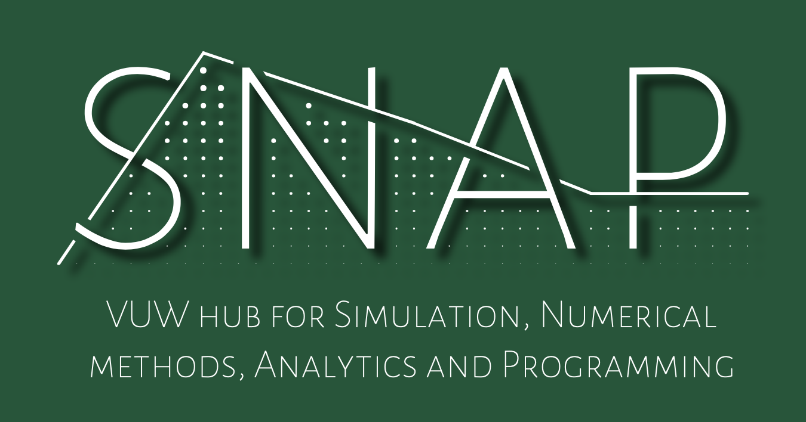

:::: {.columns}

::: {.column width="55%"}
# SNAP Workshop: Good Practices for HPC Usage

SNAP – the VUW group for Simulation, Numerics, Analytics and Programming – is hosting a series of workshops on Python and Machine Learning! SNAP was established to share computational tools among staff and students at Te Herenga Waka, Victoria University of Wellington.
Workshop details coming soon

📅 **When:** TBC  
📍 **Where:** TBC  
📝 [Register here](https://vuw.libcal.com)
:::

::: {.column width="5%"}
<!-- This is just a spacer column -->
:::

::: {.column width="40%"}
{fig-align="center"}
:::

::::
