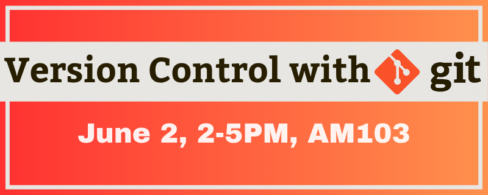

:::: {.columns}

::: {.column width="55%"}
# SNAP Workshop: Version Control with Git

SNAP – the VUW group for Simulation, Numerics, Analytics and Programming – is hosting a series of workshops on Python and Machine Learning! SNAP was established to share computational tools among staff and students at Te Herenga Waka, Victoria University of Wellington.
We are hosting an interactive workshop on getting started with Version Control with Git. We will learn what it is and why we use it. We will get you set up with Git in your own system. By the end, you will know how to track changes in your own projects
This session will be led by Angela Xue and Richard Littauer.
Who: For those curious with no experience with Git. Experience with Shell (Bash) is useful but not necessary.

No set-up needed, just Bring Your Own Laptop!

We will take you through these steps:

- What is version control and why should we use it
- Installing and setting up Git on your system
- Creating a repository
- Tracking changes
- Exploring project history
- Ignoring files
- Working with remotes in GitHub

📅 **When:** 2PM to 5PM on Tuesday 2nd June  
📍 **Where:** AM103, Kelburn Campus  
📝 [Register here](https://vuw.libcal.com/event/5905890)
:::

::: {.column width="5%"}
<!-- This is just a spacer column -->
:::

::: {.column width="40%"}
{fig-align="center"}
:::

::::
