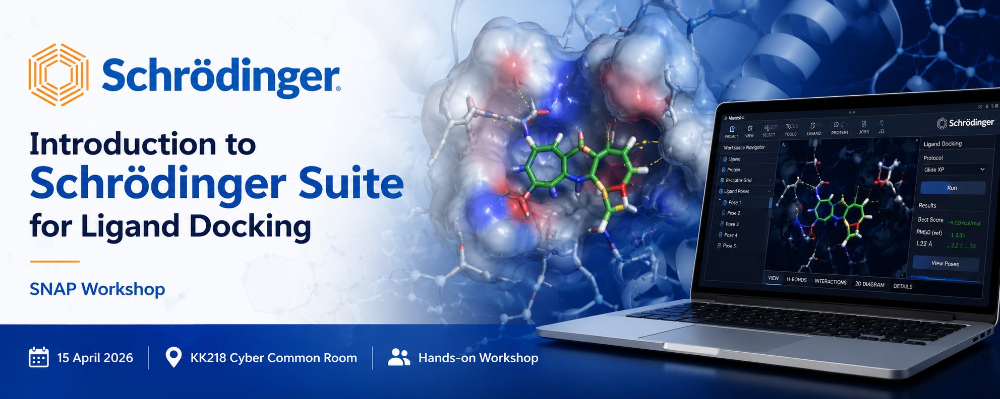

{height=250 fig-align="center"}

<h1>SNAP Workshop: Introduction to Schrödinger Suite for Ligand Docking</h1>

On 15 April 2026, SNAP hosted an introductory hands-on workshop on the Schrödinger Suite, led by Dr. Wanting Jiao. The session introduced staff and postgraduate students to ligand docking, a widely used molecular modelling technique for studying protein–ligand interactions in fields such as drug discovery and materials science.
The workshop focused on the university’s site-licensed Schrödinger Suite, with participants working through practical examples using Maestro, the platform’s graphical interface. Attendees learned how to visualise protein–ligand interactions, prepare protein and ligand structures for docking calculations, and compare different docking protocols to evaluate predicted binding conformations and affinities.
The session attracted researchers from a range of disciplines interested in applying molecular modelling techniques in their work. Starting from beginner level, the workshop provided a practical introduction to computational docking while also creating space for more advanced users to discuss research-specific challenges and workflows.
By the end of the session, participants had gained hands-on experience with tools that can support molecular design and analysis, along with a better understanding of how computational docking can complement experimental studies in modern research.

<!-- {height=500 fig-align="center"} -->

