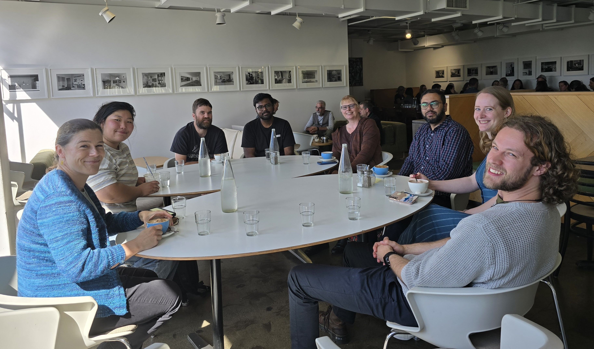
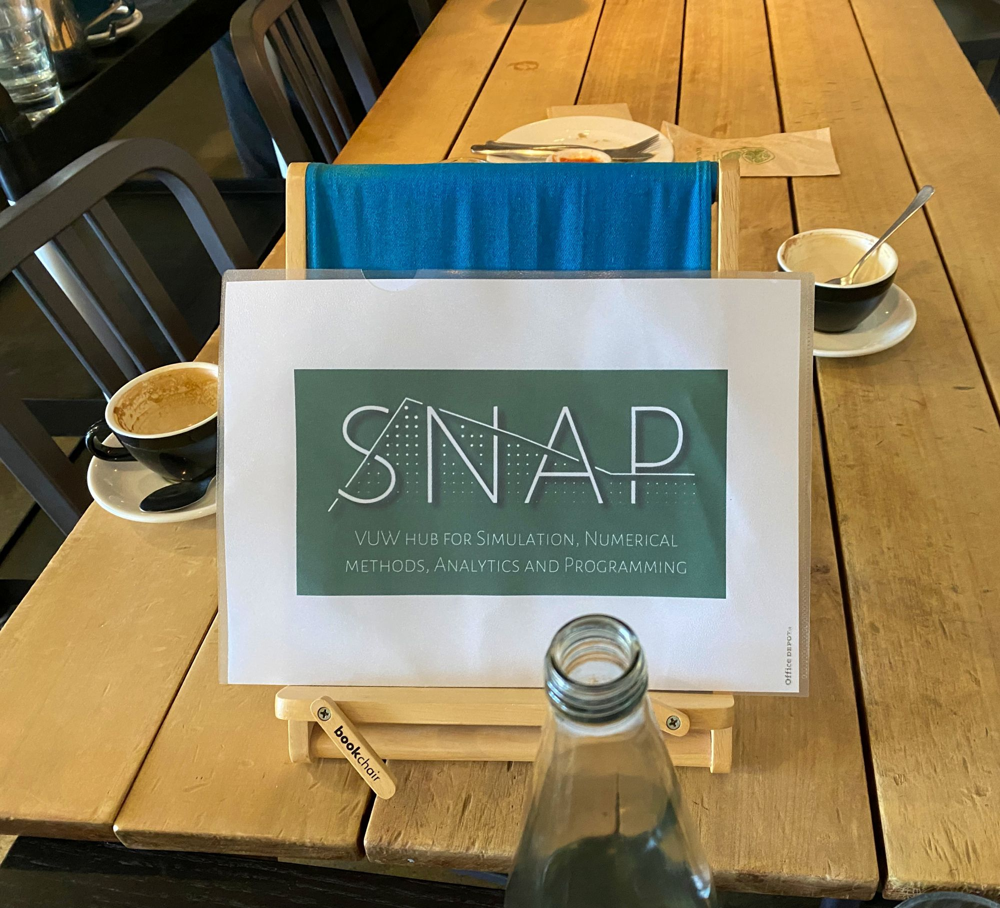

{height=500 fig-align="center"}

<h1>SNAP's monthly coffee</h1>

Join us for coffee with others who use simulation, numerics, analytics, and programming in their research, every third Wednesday of the month from 10:30 to 11:00 at Milk and Honey, Kelburn Campus.

This month’s coffee meet-up had a good turnout. Our main discussion centred on the previous weekend’s severe weather and strong winds that caused flooding, fallen trees, and emergencies in parts of the country. Participants also talked about recent HPC disk and login node issues. The conversation offered a useful balance of social catch-up and practical discussion about research computing workflows.

These informal sessions continue to offer a welcoming space to connect with other SNAP members and meet SNAP champions, who also form the SNAP planning committee.

{height=250 fig-align="center"}
