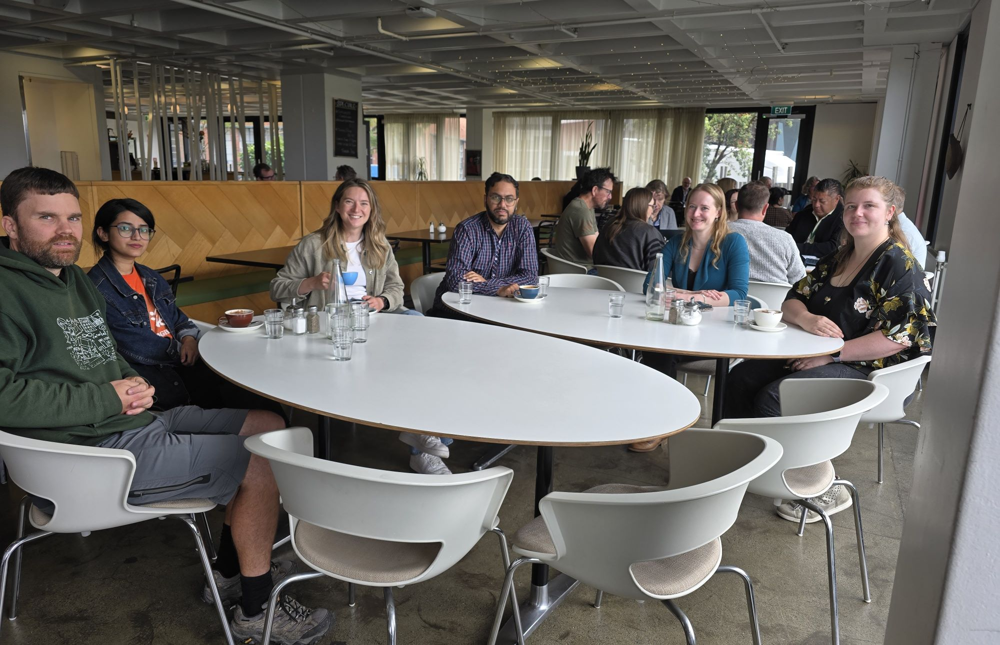

{height=500 fig-align="center"}

<h1>SNAP's monthly coffee</h1>

Join us for coffee with others who use simulation, numerics, analytics, and programming in their research, every third Wednesday of the month from 10:30 to 11:00 at Milk and Honey, Kelburn Campus.

This month’s coffee meet-up marked our first gathering after the Christmas and New Year break and had a reasonable turnout. Alongside catching up on holiday news and plans for the year ahead, participants discussed recent HPC disk and login node issues, as well as experiences using VS Code Server on login nodes. The conversation provided a useful mix of social catch-up and practical discussion around research computing workflows.

These informal sessions continue to offer a welcoming space to connect with other SNAP members and meet SNAP champions, who also form the SNAP planning committee.

{height=250 fig-align="center"}
