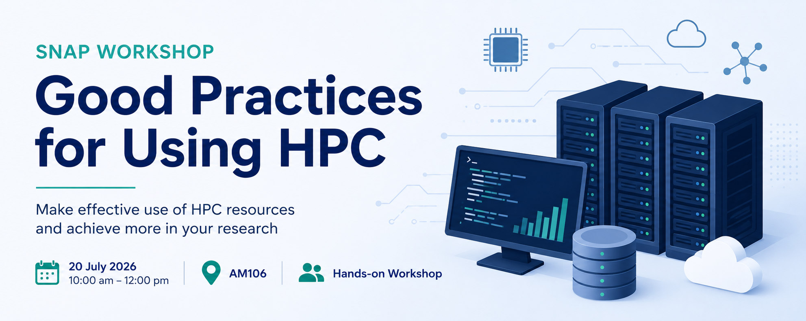
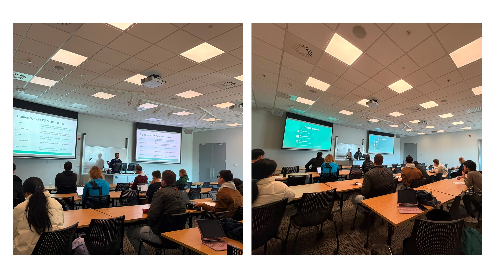

{height=250 fig-align="center"}

<h1>SNAP Workshop on Good Practices using HPC</h1>

On 20 July 2026, SNAP hosted a workshop on Good Practices for Using High Performance Computing (HPC), presented by Dr. Muhammad Hashmi and Dr. Brendan Harding. The session introduced participants to the effective and responsible use of the Rāpoi HPC cluster, providing practical guidance for both new and experienced users.

The workshop began with an introduction to the fundamentals of HPC, including how to access the Rāpoi cluster, understand its partitions, and make effective use of software modules. Participants learned how to prepare and submit Slurm batch jobs, with an explanation of common sbatch options, as well as how to monitor job progress and evaluate job efficiency. These topics provided attendees with the essential knowledge needed to use shared computing resources effectively and make the most of the cluster.

The second half of the workshop, led by Brendan, explored more advanced HPC concepts, including parallel and distributed computing using the Message Passing Interface (MPI). Participants gained an overview of how MPI enables applications to run across multiple processors and learned best practices for writing and running efficient parallel workloads. The session also discussed strategies for improving resource utilisation and performance, helping researchers optimise their computational workflows.

The workshop brought together staff, Postdoctoral Researchers, and postgraduate students from a range of disciplines who use—or are planning to use—the Rāpoi HPC cluster. By combining practical demonstrations with discussions of advanced computing techniques, the session equipped participants with valuable skills for making more efficient use of high-performance computing resources in their research.

The presentation of this workshop is available [here](Raapoi_Good_Practices_Beginner.pdf).

{height=500 fig-align="center"}

