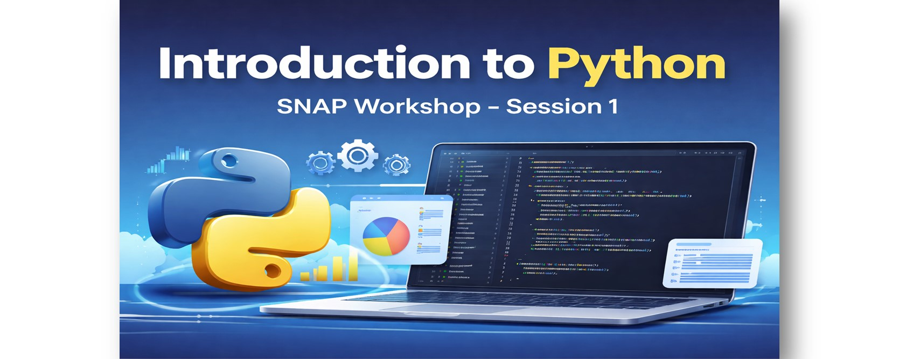
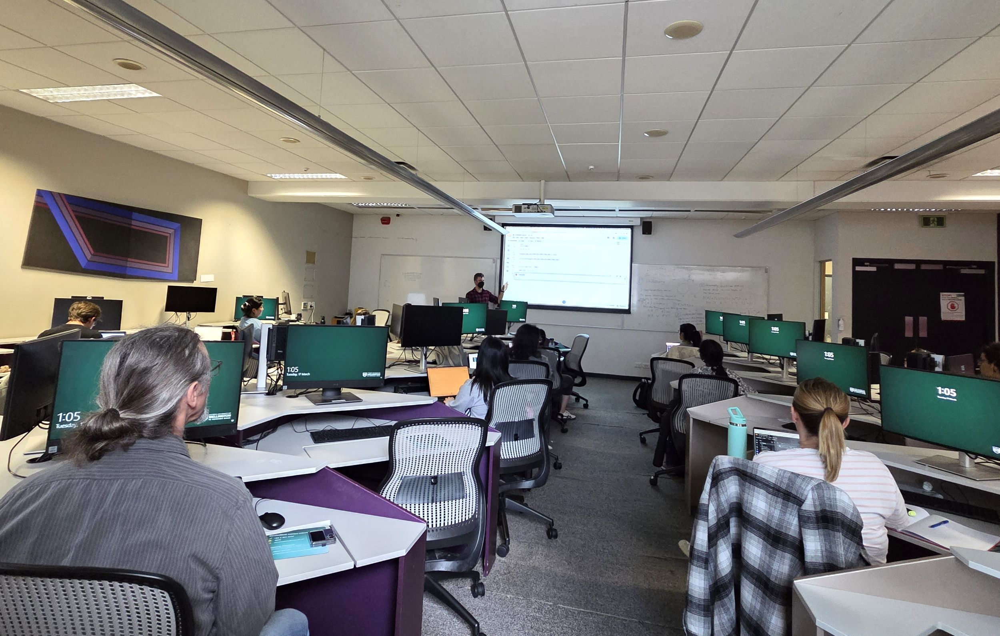

{height=250 fig-align="center"}

<h1>SNAP Workshop: Introduction to Python - Session 01</h1>

On 17 March 2026, SNAP hosted the first session of the “Introduction to Python and Machine Learning” workshop series. The session was led by Angela Xue (School of Chemical and Physical Sciences) and Richard Littauer (Engineering and Computer Science), both PhD students, with Dr. Emily O’Riordan (Engineering and Computer Science) assisting during the workshop.
Around 20 students from various disciplines attended the session, including chemistry, social sciences, mathematics, and computer science. The workshop introduced participants to the fundamentals of Python programming, covering key concepts such as variables, built-in functions, loops, and user-defined functions. Attendees also learned how to import and use essential Python libraries for data analysis and visualisation.
The session was designed to provide participants with the fundamental skills necessary to start working with Python in their research. Python has become a popular tool across various disciplines, enabling researchers to analyse large datasets, automate workflows, and create visualisations to better understand their data.
For those who were unable to attend or would like to explore the material further, the full lesson content is available through [The Carpentries Python lesson](https://swcarpentry.github.io/python-novice-inflammation/index.html).

{height=500 fig-align="center"}

