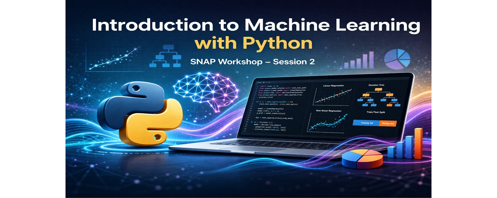
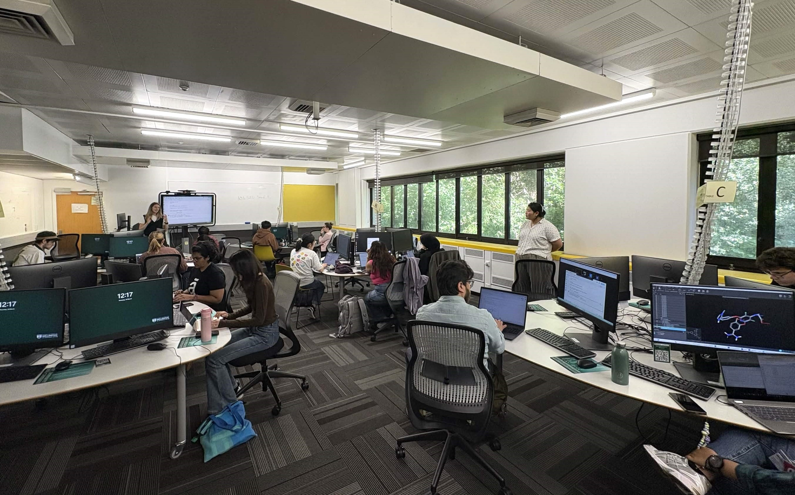

{height=250 fig-align="center"}

<h1>SNAP Workshop: Introduction to Machine Learning with Python - Session 02</h1>

SNAP hosted the second session of the “Introduction to Python and Machine Learning” workshop series on 19 March 2026. This session was led by Dr. Emily O’Riordan, a lecturer in Artificial Intelligence and Machine Learning at the School of Engineering and Computer Science, with support from Angela Xue and Richard Littauer.
The workshop offered a practical introduction to machine learning concepts using the Python library Scikit-learn. Participants examined techniques such as linear and non-linear regression, decision trees, and methods for dividing data into training and testing sets. Through guided examples, attendees discovered how machine learning models can be trained and assessed within a Python workflow.
The session was attended by more than a dozen students from diverse academic backgrounds, including computer science, linguistics, and other fields interested in developing computational research skills.
Along with the initial session, the workshop series provided a comprehensive eight-hour introduction to Python programming and machine learning, enabling participants to delve deeper into these topics than in typical short workshops. The session loosely followed the Carpentries lesson Introduction to Machine Learning with Scikit-learn, which participants can further explore on their own.

{height=500 fig-align="center"}

