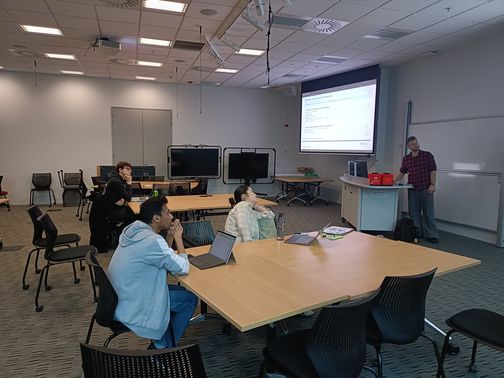

{height=250 fig-align="center"}

<h1>SNAP Workshop on Version Control with Git</h1>

The SNAP student team organised and hosted their second workshop this year on Version Control with Git, led by PhD candidates Angela Xue and Richard Littauer. Version control is a powerful tool for researchers and developers that help us keep track of and collaborate on our projects; Git is the industry standard programme for this purpose.

The installation of programmes can often be a barrier to use, so the instructors began their workshop by helping attendees install Git and the necessary tools, allowing them to follow along on their devices. From there, following the instructors' leads, we created a mock project, through which we made and committed changes, navigated through our projects' history, and restored past versions. Finally, attendees were able to upload their projects to GitHub for worldwide sharing.
Angela guided more of the hands-on experience with Git, while Richard discussed wider concepts of Git and its use with collaboration in a professional context.

This lesson followed the first 7 episodes of the publicly available lesson on the [Carpentries](https://swcarpentry.github.io/git-novice) website by the same name. A presentation was also prepared for this workshop and is available [here](VersionControlGit.pdf).

{height=500 fig-align="center"}

